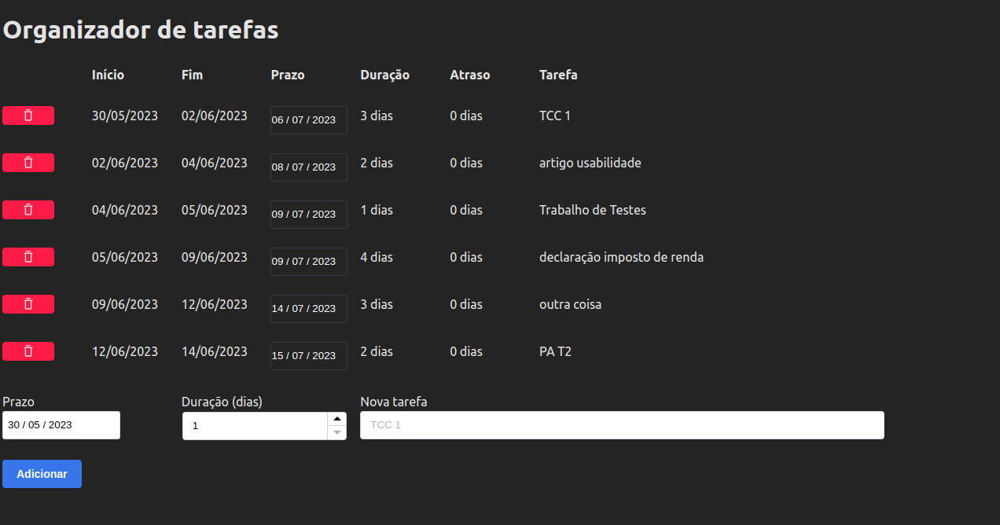
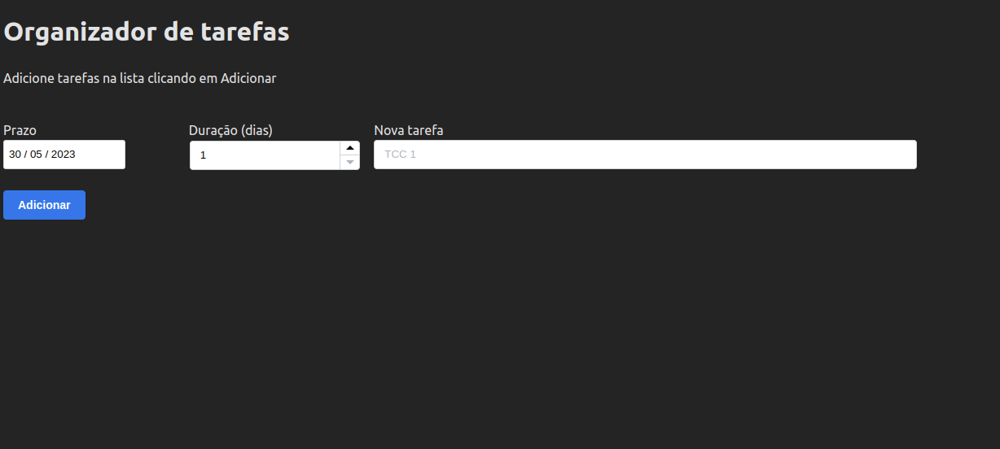
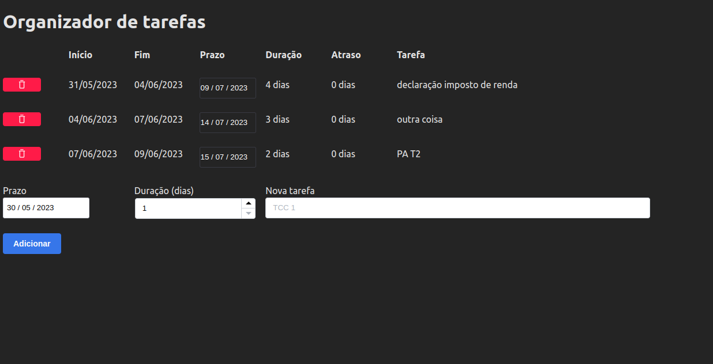

# Organizador de tarefas

**Número da Lista**: 19

**Conteúdo da Disciplina**: Greed

## Alunos
| Matrícula  | Aluno                                                       |
| ---------- | ----------------------------------------------------------- |
| 16/0127912 | [João Vitor Ferreira Alves](https://github.com/vitorAlves7) |
| 16/0149410 | [Yudi Yamane de Azevedo](https://github.com/yudi-azvd)      |


## Sobre 
Essa é uma aplicação para organizar as suas tarefas. Você fornece o prazo e 
a quantidade de tempo para a tarefa e a ordenação acontece sozinha! Você
também pode reajustar os prazos já inseridos e excluir tarefas da lista.

### Apresentação

O vídeo está em [...](.).

Você também pode assistir a [...](#)
pelo YouTube.

## Screenshots







## Instalação 
**Linguagem**: TypeScript

**Framework**: Svelte

Você precisa do [Node.js](https://nodejs.org/en) versão 16+ e de um gerenciador
de pacotes como
[npm](https://docs.npmjs.com/downloading-and-installing-node-js-and-npm),
[pnpm](https://pnpm.io/installation) ou yarn.

Instale as dependências:

```sh
npm i
# ou se você usa pnpm:
pnpm i
```

Inicie o servidor da aplicação:

```sh
npm run dev
# ou
pnpm dev
```

Acesse a aplicação em http://localhost:5173/.

